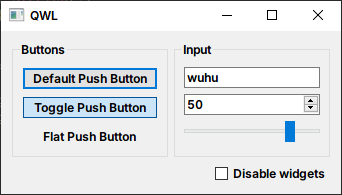

## QWL

Make your QWidget code looks like QML.

---

## Example

```cpp
QSlider* s0 = new QSlider;
QSlider* s1 = nullptr;

QSlider* slider = Slider {
    id << s0; // Use existed instance. If it is not set, it is automatically created
    id >> s1; // Save to a variable
    
    value = 80, /* or */ value(80),

    orientation = Qt::Horizontal

    onValueChanged([](int v) { qDebug() << v; })
};
```

A larger example:

```cpp
using namespace qwl;

auto checkBox  = new QCheckBox;
auto groupBox1 = new QGroupBox;
auto groupBox2 = new QGroupBox;

QWidget* w = Widget {
    GridLayout {
        GridLayout::colStretch(0, 1),
        GridLayout::colStretch(1, 1),

        GridLayout::Attached::row(0).col(0) |
        GroupBox {
            id << groupBox1,

            title = "Buttons",

            VBoxLayout {
                PushButton { text = "Default Push Button", default_ = true },
                PushButton { text = "Toggle Push Button" , checkable = true, checked = true },
                PushButton { text = "Flat Push Button"   , flat = true },
                BoxLayout::Stretch(1)
            }
        },

        GridLayout::Attached::row(0).col(1) |
        GroupBox {
            id << groupBox2,

            title = "Input",

            VBoxLayout {
                LineEdit { text = "wuhu" },
                SpinBox  { value = 50 },
                Slider   { orientation = Qt::Horizontal, value = 80 },
                BoxLayout::Stretch(1)
            }
        },

        GridLayout::Attached::row(1).rowSpan(1).colSpan(2) |
        HBoxLayout {
            BoxLayout::Stretch(1),
            CheckBox {
                id << checkBox,

                text = "Disable widgets",

                onToggled(groupBox1, &QWidget::setDisabled),
                onToggled(groupBox2, &QWidget::setDisabled)
            }
        }
    }
};
```



## Summarize

Advantages
- It's really like qwl

Disadvantages
- intellisense don't work very well

## About Property Binding:
This library is currently experimental, I didn't provide this feature.

But you can look at [nwidget](https://github.com/HuaiminNotSleepYet/nwidget), which provides `declarative syntax` and `property binding`.
